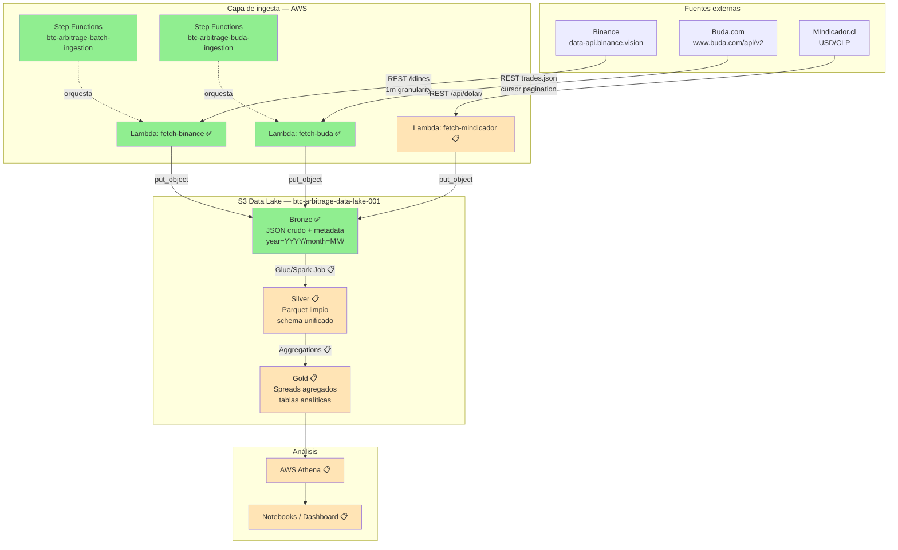

# Crypto Arbitrage Scanner

Pipeline de Data Engineering en AWS para reconstruir el histórico de spreads
de Bitcoin entre Binance (mercado global, BTC-USDT) y Buda.com (mercado
chileno, BTC-CLP), normalizado por el tipo de cambio USD/CLP.

> **Estado:** capa Bronze completa para Binance y Buda. Capas Silver, Gold y
> la fuente USD/CLP están en roadmap.

---

## ¿Qué resuelve?

Los exchanges chilenos suelen tener spreads sostenidos respecto al precio
internacional de BTC, derivados de baja liquidez, fricciones de cambio CLP/USD
y arbitraje imperfecto. Este proyecto construye la base de datos histórica
necesaria para cuantificar ese fenómeno minuto a minuto desde 2017.

El pipeline ingesta dos fuentes con contratos muy distintos, las normaliza en
una capa Silver común y produce series temporales alineadas para análisis.
**No es un sistema de trading**: es un proyecto de portfolio orientado a
demostrar diseño de pipelines batch en AWS, con énfasis en idempotencia,
observabilidad y decisiones explícitas sobre trade-offs.

---

## Arquitectura



**Leyenda:** verde = implementado, amarillo = pendiente.

---

## Métricas del estado actual

Capa Bronze, ambas fuentes:

| Métrica                              | Binance (BTCUSDT)              | Buda (BTC-CLP)                 |
|--------------------------------------|--------------------------------|--------------------------------|
| Granularidad de la fuente            | Klines de 1 minuto             | Trades raw                     |
| Cobertura temporal                   | 2017-08 → 2026-04              | 2015-01 → 2026-04              |
| Días cubiertos                       | ~3.180                         | 4.138                          |
| Records ingeridos                    | ~4.5M klines                   | (a calcular en Silver)         |
| Archivos en S3                       | 112                            | 246                            |
| Particionado                         | Hive (`year=YYYY/month=MM/`)   | Hive                           |
| Verificación end-to-end              | gap-free, dedup en Silver      | 0 gaps, 0 solapes (validado)   |
| Tiempo de backfill total             | 7 min 27 s (concurrency=3)     | ~10 h (concurrency=1)          |

Las dos fuentes tienen modelos de paginación, rate limits y ventanas de
disponibilidad distintos, lo que motivó dos pipelines separados con
heurísticas adaptadas a cada API.

---

## Stack

- **Cloud:** AWS (us-east-2)
- **Compute:** AWS Lambda (Python 3.11)
- **Orquestación:** AWS Step Functions
- **Storage:** Amazon S3 (data lake con particionado Hive)
- **IaC:** Terraform (provider AWS ~> 5.0)
- **Procesamiento (planeado):** AWS Glue / PySpark
- **Análisis (planeado):** AWS Athena
- **Lenguajes:** Python, HCL, SQL

---

## Estructura del proyecto

```
crypto-arbitrage-scanner/
├── infra/                              # Terraform IaC
│   ├── main.tf
│   └── variables.tf
├── lambdas/                            # Código de Lambdas
│   ├── fetch_binance/
│   │   └── handler.py
│   └── fetch_buda/
│       └── handler.py
├── docs/
│   ├── api_discovery.md                # Análisis empírico de las APIs
│   ├── data_quality.md                 # Reglas y validaciones por capa
│   └── pipeline_design.md              # Decisiones de diseño
├── scripts/
│   ├── generate_backfill_periods.py    # Generador de períodos Binance
│   ├── generate_buda_periods.py        # Generador adaptativo Buda
│   └── sample_buda_monthly_volume.py   # Muestreo previo al backfill
├── transformations/                    # 📋 Bronze → Silver → Gold
├── tests/
├── build_lambdas.sh                    # Empaquetado reproducible de zips
└── README.md
```

---

## Cómo ejecutarlo

### Prerequisitos

- AWS CLI con credenciales configuradas
- Terraform >= 1.5
- Python 3.11+
- `zip`, `unzip` y `bash` en el PATH

### Despliegue de la infraestructura

```bash
cd infra/
terraform init
terraform apply
```

Crea: el bucket S3 `btc-arbitrage-data-lake-001`, dos Lambdas (`fetch-binance`,
`fetch-buda`), dos Step Functions y los IAM roles correspondientes.

### Empaquetado de las Lambdas

```bash
./build_lambdas.sh                      # empaqueta todas
./build_lambdas.sh fetch_buda           # empaqueta una sola
```

Whitelist explícita de archivos `.py`; produce zips reproducibles (`zip -X`)
para que `source_code_hash` en Terraform sea estable cuando el código no
cambia.

### Backfill histórico

**Binance** (concurrencia 3, ~7.5 min para 9 años):

```bash
python scripts/generate_backfill_periods.py > backfill_input.json

aws stepfunctions start-execution \
  --state-machine-arn $(cd infra && terraform output -raw state_machine_arn) \
  --input file://backfill_input.json
```

**Buda** (concurrencia 1, ~10 h para 11 años):

```bash
python scripts/sample_buda_monthly_volume.py > buda_monthly_volume_sampled.json
python scripts/generate_buda_periods.py > backfill_buda_input.json

aws stepfunctions start-execution \
  --state-machine-arn $(cd infra && terraform output -raw buda_state_machine_arn) \
  --input file://backfill_buda_input.json \
  --name "buda-backfill-$(date +%Y%m%d-%H%M%S)"
```

El backfill de Buda corre en serie (`MaxConcurrency = 1`) para no saturar
el rate limit del exchange. Para corridas reales conviene partir en sub-lotes
por año.

### Verificación

```bash
# Conteo de archivos por fuente
aws s3 ls s3://btc-arbitrage-data-lake-001/bronze/backtest/binance/ --recursive | wc -l
aws s3 ls s3://btc-arbitrage-data-lake-001/bronze/backtest/buda/ --recursive | wc -l

# Sanity check de cobertura Buda (gaps + solapes)
python scripts/verify_buda_coverage.py
```

---

## Decisiones de arquitectura

Las cuatro decisiones más relevantes; cada una con un ADR detallado en
`docs/adr/` (en redacción).

### 1. Endpoint Binance: `data-api.binance.vision`

Las IPs de AWS en regiones US son rechazadas con `HTTP 451` por el endpoint
estándar (`api.binance.com`) debido a restricciones regulatorias. El
subdominio público `data-api.binance.vision` expone el mismo contrato de
market data sin restricción geográfica. La detección requirió un "ping de
diagnóstico" al inicio del handler que loguea la IP de salida — práctica que
adoptamos en ambos handlers. Detalles en
[`docs/api_discovery.md`](docs/api_discovery.md).

### 2. Bronze fiel a la fuente, deduplicación en Silver

Ambas Lambdas escriben la respuesta cruda de la API, sin transformación,
incluyendo solapamientos esperados por la semántica de paginación (Binance:
`endTime` inclusivo; Buda: cursor exclusivo). La limpieza ocurre en Silver,
donde los datos ya están en Parquet con esquema unificado.

Trade-off explícito: aceptamos < 0.003% de duplicados en Bronze para
preservar la propiedad de "reprocesabilidad sin re-llamar a las APIs". Ver
[`docs/data_quality.md`](docs/data_quality.md).

### 3. Granularidad adaptativa por sampling empírico (Buda)

A diferencia de Binance, donde un mes siempre es un archivo, Buda divide
cada mes en 1, 2 o 4-5 archivos según el volumen muestreado del día 15.
El generador (`generate_buda_periods.py`) traduce el sample a una estimación
de `wall_clock` para una Lambda y ajusta la granularidad para mantenerse
dentro del timeout de 900s con margen.

La heurística falla en meses con eventos exógenos concentrados temporalmente
(ej. el rally de BTC del 24-31 dic 2020): el sample del día 15 cayó en zona
calma y subestimó el mes. Mitigación aplicada: override puntual sub-semanal
en quincenas problemáticas. Ver [`docs/data_quality.md`](docs/data_quality.md) §5.6.

### 4. Throttle calibrado empíricamente con instrumentación

El handler de Buda incluye instrumentación (`wall_clock_seconds`,
`effective_rps`, `nominal_rps`, `throttle_429_events`) que escribe métricas
en cada archivo Bronze. Esto permitió **bajar `BUDA_THROTTLE_SECONDS`
iterativamente** de 3.0s → 2.0s → 1.0s, cada paso justificado por evidencia
del paso anterior:

| Throttle | Ejecuciones validadas | 429 events |
|----------|-----------------------|------------|
| 3.0s     | 92                    | 0          |
| 2.0s     | 55                    | 0          |
| 1.0s     | 100                   | 0          |

Total: 247 ejecuciones, 0 throttle events. El cambio reduciría
significativamente el tiempo de backfills futuros sobre otros pares de
Buda (eth-clp, ltc-clp). Ver [`docs/api_discovery.md`](docs/api_discovery.md) §2.8.

---

## Roadmap

### ✅ Fase A.1 — Ingesta histórica de Binance (completado)
- [x] Lambda con paginación, idempotencia, manejo de rate limits
- [x] Step Functions orquestando 112 invocaciones mensuales (concurrency 3)
- [x] ~4.5M klines en data lake S3 con particionado Hive

### ✅ Fase A.2 — Ingesta histórica de Buda (completado)
- [x] Handler con paginación inversa por cursor exclusivo
- [x] Granularidad adaptativa basada en sampling empírico
- [x] Instrumentación en metadata para calibración del throttle
- [x] Backfill 2015-2026 con verificación end-to-end (0 gaps, 0 solapes)

### 📋 Fase A.3 — Tipo de cambio USD/CLP
- [ ] Handler para MIndicador.cl
- [ ] Forward-fill de fines de semana y festivos chilenos

### 📋 Fase A.4 — Capa Silver
- [ ] Glue / PySpark Lambda: JSON → Parquet
- [ ] Reconstrucción OHLCV minutal desde trades de Buda
- [ ] Schema unificado entre Binance y Buda
- [ ] Deduplicación y forward-fill documentados en
      [`docs/data_quality.md`](docs/data_quality.md)

### 📋 Fase A.5 — Capa Gold y análisis
- [ ] Joins temporales Binance ↔ Buda ↔ USD/CLP
- [ ] Tablas agregadas de spreads (1m, 5m, 1h, 1d)
- [ ] Athena queries y dashboards de hallazgos

### 📋 Fase B — Live monitoring (futuro lejano)
Arquitectura bosquejada (no implementada): Fargate task con WebSocket a
`data-stream.binance.vision` + polling a Buda, evaluado por EventBridge,
con notificaciones cuando un spread excede umbral histórico de N
desviaciones estándar.

---

## Lecciones aprendidas

Material seleccionado del proceso de construcción. La lista no es exhaustiva
ni ordenada por importancia.

- **Geo-bloqueos no son visibles hasta que pegan.** Diagnosticar `HTTP 451`
  desde Lambda en us-east-2 fue lo que motivó migrar al subdominio público
  de market data. El "ping de diagnóstico" (loguear la IP de salida al
  inicio del handler) ahorró horas de debugging y se volvió práctica
  estándar en ambas Lambdas.

- **Paralelización trivial > optimización compleja.** El backfill de Binance
  pasó de ~1 día (script secuencial) a 7.5 minutos con Step Functions y
  concurrencia 3, sin tocar el código del handler.

- **Instrumenta antes de optimizar.** El throttle de Buda se bajó tres veces
  basándose en métricas de cada ejecución (`effective_rps`, `wall_clock`).
  Sin esa instrumentación, cualquier ajuste habría sido especulativo. La
  evidencia de 92 ejecuciones a 3.0s sin un solo `429` fue lo que justificó
  pasar a 2.0s, no la ansiedad de "ir más rápido".

- **Las heurísticas de muestreo fallan en distribuciones heterogéneas.**
  El sample del día 15 funciona bien para meses con volumen uniforme, pero
  subestima sistemáticamente meses con eventos exógenos concentrados (rally
  del 24-31 dic 2020, flash crash del 19 may 2021). El sistema correcto no
  es uno con un sample mejor, sino uno con override puntual cuando el
  sample falla — más simple y más robusto.

- **"Bronze fiel a la fuente" es resiliencia, no purismo.** Documentar el
  solapamiento de paginación en lugar de evitarlo en el handler significa
  que cualquier cambio futuro en la lógica de limpieza (Silver) se hace
  sin re-llamar a las APIs. La asimetría de trade-offs es enorme: un costo
  trivial (deduplicar en Silver) por un beneficio gigantesco (idempotencia
  completa del re-procesamiento).

- **El refactor a posteriori suele ser una mala respuesta a un fallo
  puntual.** Hubo dos puntos en el backfill de Buda donde fue tentador
  reescribir el sistema (Lambda chaining, scheduler intermedio). En ambos
  casos, la respuesta correcta fue un parámetro mejor calibrado, no una
  arquitectura nueva. El sesgo está bien documentado: Gall's Law (Gall,
  1975) y el capítulo de "Postmortem Culture" en *Site Reliability
  Engineering* (Beyer et al., 2016).

---

## Licencia

Por definir. Ningún archivo de este repositorio contiene datos de mercado;
los datos viven en S3 y se descargan ejecutando el pipeline.

---