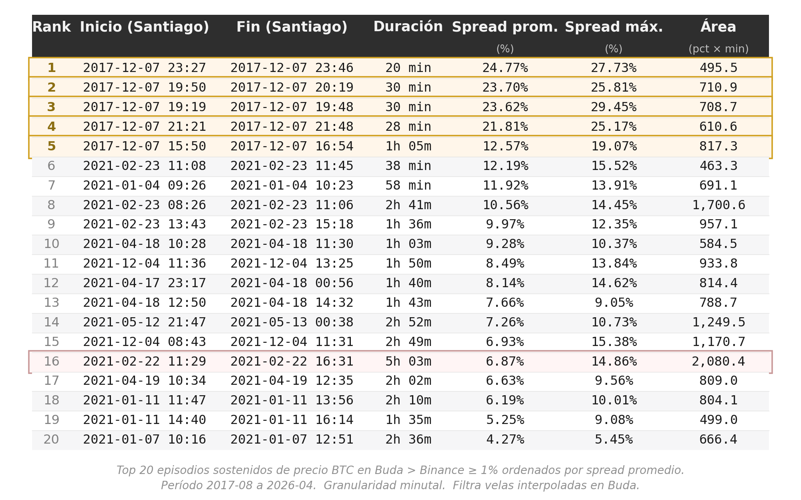
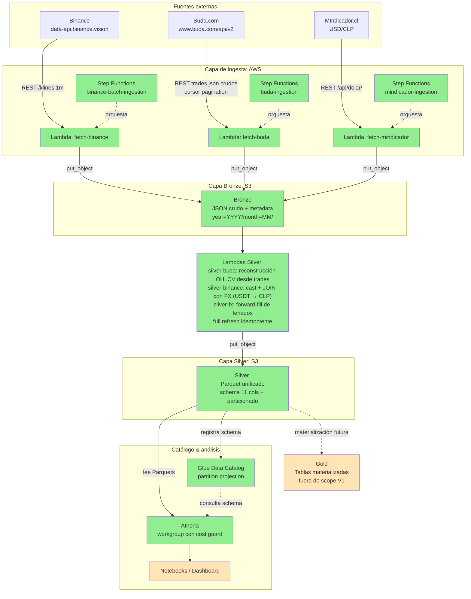

# Crypto Arbitrage Scanner

Este es un proyecto de Data Engineering cuyo objetivo es reconstruir el histórico de diferenciales de precio de Bitcoin entre Binance (BTC-USDT) y Buda.com (BTC-CLP), normalizado por el tipo de cambio USD/CLP.

> **English summary:** End-to-end AWS data pipeline that ingests Bitcoin market data from Binance and Buda.com at minute-level granularity, combined with daily USD/CLP FX rates from the Central Bank of Chile. The pipeline normalizes data into a unified Silver layer in Parquet and exposes it via Athena with partition projection for cost-controlled analytical queries. Built with Lambda, Step Functions, S3, Glue, and Terraform. Demo query identifies sustained arbitrage episodes (Buda premium ≥ 1%) across 9 years of data. 

## Resultados
En los casi 9 años de datos analizados (agosto 2017 a abril 2026), se identificaron 34 horas de oportunidades de arbitraje significativas. Se define como "oportunidad significativa" aquella que presentó estas dos características simultáneamente:
- **Persistencia:** Una diferencia de precio sostenida por más de 5 minutos consecutivos para mitigar el efecto de anomalías temporales o baja liquidez puntual.
- **Rentabilidad:** Un sobreprecio de Buda respecto a Binance superior al 1%, definido como el umbral mínimo para compensar costos operativos, comisiones de intercambio y el tipo de cambio diario.



Dentro del periodo analizado, los momentos de mayor intensidad llegaron a diferencias promedio de **24%** con picos cercanos al **30%** (los 5 primeros episodios resaltados en la imagen, correspondientes al 7 de diciembre de 2017, el día en que BTC cruzó los USD 15.000 por primera vez). Mientras que el episodio de mayor duración alcanzó las 5 horas con 3 minutos (febrero 2021, destacado en rojo).

## ¿Qué resuelve?

El proyecto parte de la hipótesis de que los exchanges chilenos como Buda.com pueden presentar diferenciales de precio sostenidos respecto al mercado internacional de BTC, derivados de baja liquidez, fricciones de cambio CLP/USD y barreras operativas para el arbitraje. Este proyecto construye la base de datos histórica necesaria para cuantificar ese fenómeno minuto a minuto desde 2017.

El pipeline ingiere tres fuentes con esquemas distintos, las normaliza en una capa Silver común y produce series temporales alineadas para análisis. **No es un sistema de trading**: es un proyecto de portfolio orientado a demostrar diseño de pipelines batch en AWS, con énfasis en idempotencia, observabilidad y decisiones explícitas sobre concesiones técnicas.

## Arquitectura



**Leyenda:** verde = implementado, amarillo = fuera de scope actual.

## Métricas del estado actual

### Capa Bronze

| Métrica                  | Binance (BTCUSDT)              | Buda (BTC-CLP)                 |
|--------------------------|--------------------------------|--------------------------------|
| Granularidad de la fuente| Klines de 1 minuto             | Trades raw                     |
| Cobertura temporal       | 2017-08 - 2026-04              | 2015-01 - 2026-04              |
| Días cubiertos           | ~3.180                         | 4.138                          |
| Records ingeridos        | ~4.5M klines                   | ~2.67M trades                  |
| Archivos en S3           | 112                            | 246                            |
| Particionado             | Hive (`year=YYYY/month=MM/`)   | Hive                           |
| Verificación end-to-end  | gap-free, dedup en Silver      | 0 gaps, 0 solapes (validado)   |
| Tiempo de backfill total | 7 min 27 s (concurrency=3)     | ~10 h (concurrency=1)          |

La fuente FX (Mindicador.cl) tiene su propia escala: un único archivo JSON con 2.825 registros diarios cubriendo 2015-01 a 2026-05 (107 KB), ingerido en una sola invocación de Lambda.

### Capa Silver

| Métrica                  | silver-buda           | silver-binance        | silver-fx           |
|--------------------------|-----------------------|-----------------------|---------------------|
| Velas / registros        | 5.83M velas           | 4.58M velas           | 4.143 fechas        |
| % interpolado / ffilled  | 80.9% interpolado     | 0.19% interpolado     | 31.84% ffilled      |
| Particiones generadas    | 134 (year/month)      | 105 (year/month)      | 1 (archivo único)   |
| Tiempo de ejecución      | 47.6 s                | 96.6 s                | 6.04 s              |
| Peak de memoria          | ~500 MB / 3008 MB     | 2467 MB / 3008 MB     | <100 MB / 512 MB    |
| Schema                   | unified_candles (11 cols) | unified_candles (11 cols) | fx_usdclp (3 cols) |

## Stack

- **Cloud:** AWS (us-east-2)
- **Compute:** AWS Lambda (Python 3.11)
- **Procesamiento:** pandas + pyarrow (en Lambda)
- **Orquestación:** AWS Step Functions
- **Storage:** Amazon S3 (data lake con particionado Hive)
- **Catálogo y análisis:** AWS Glue Data Catalog (partition projection) + Athena
- **IaC:** Terraform (provider AWS ~> 5.0)
- **Lenguajes:** Python, HCL, SQL

## Estructura del proyecto

```bash
crypto-arbitrage-scanner/
├── infra/                              
│   ├── main.tf
│   ├── variables.tf
│   └── athena_queries/
│       └── spread_episodes.sql        
├── lambdas/
│   ├── common/
│   │   └── fx.py                      
│   ├── fetch_binance/
│   │   └── handler.py
│   ├── fetch_buda/
│   │   └── handler.py
│   ├── fetch_mindicador/
│   │   └── handler.py
│   ├── silver_buda/
│   │   └── handler.py
│   ├── silver_binance/
│   │   └── handler.py
│   └── silver_fx/
│       └── handler.py
├── docs/
│   ├── adr/
│   │   ├── adr_007_silver_buda_architecture.md
│   │   ├── adr_008_silver_binance_architecture.md
│   │   └── adr_009_silver_fx_architecture.md
│   ├── api_discovery.md              
│   └── pipeline_design.md              
│   ├── generate_backfill_periods.py   
│   ├── generate_buda_periods.py       
│   ├── sample_buda_monthly_volume.py  
│   ├── buda_monthly_volume_sampled.json 
│   ├── verify_bronze_coverage.py       
│   └── generate_top_by_spread.py       
├── backfill_inputs/
│   ├── active_v2/                      
│   ├── archived_v1/                    
│   ├── buda_overrides/                 
│   └── README.md
├── tests/
│   └── benchmark_mindicador.py         
├── assets/
│   └── top_episodes_by_spread.png      
├── build_lambdas.sh                    
├── .gitignore
└── README.md
```

## Cómo ejecutarlo

### Prerequisitos

- AWS CLI con credenciales configuradas
- Terraform >= 1.5
- Python 3.11+
- `zip`, `unzip` y `bash` en el PATH

### Despliegue de la infraestructura

```bash
cd infra/
terraform init
terraform apply
```

Crea: el bucket S3 `btc-arbitrage-data-lake-001`, las Lambdas de ingesta (`fetch-binance`, `fetch-buda`, `fetch-mindicador`) y de transformación (`silver-buda`, `silver-binance`, `silver-fx`), las Step Functions de ingesta para cada fuente, el catálogo Glue con partition projection, el workgroup de Athena con cost guardrail (200 MB), el bucket de resultados de Athena con lifecycle de 7 días, y los IAM roles correspondientes.

### Empaquetado de las Lambdas

```bash
./build_lambdas.sh                      # para empaquetar todas las lambdas
./build_lambdas.sh <lambda_name>        # para empaquetar una sola lambda, por ejemplo: fetch_buda
```

Whitelist explícita de archivos `.py`; produce zips reproducibles (`zip -X`) para que `source_code_hash` en Terraform sea estable cuando el código no cambia. Las Lambdas listadas en `LAMBDAS_NEEDING_COMMON` (`silver_binance`, `silver_fx`) embeben además el módulo `lambdas/common/`.

### Backfill histórico

**Binance** (concurrencia 3, ~7.5 min para 9 años):

```bash
python scripts/generate_backfill_periods.py > backfill_input.json

aws stepfunctions start-execution \
  --state-machine-arn $(cd infra && terraform output -raw state_machine_arn) \
  --input file://backfill_input.json
```

**Buda** (concurrencia 1, ~10 h para 11 años):

```bash
python scripts/sample_buda_monthly_volume.py > buda_monthly_volume_sampled.json
python scripts/generate_buda_periods.py > backfill_buda_input.json

aws stepfunctions start-execution \
  --state-machine-arn $(cd infra && terraform output -raw buda_state_machine_arn) \
  --input file://backfill_buda_input.json \
  --name "buda-backfill-$(date +%Y%m%d-%H%M%S)"
```

El backfill de Buda corre en serie (`MaxConcurrency = 1`) para no saturar el rate limit del exchange. Para corridas reales conviene partir en sub-lotes por año.

### Backfill de USD/CLP (Mindicador.cl)

Una sola invocación, archivo único, ~6 segundos:

```bash
aws stepfunctions start-execution \
  --state-machine-arn $(cd infra && terraform output -raw mindicador_state_machine_arn) \
  --input '{}'
```

Idempotente: cada ejecución re-descarga toda la serie histórica desde 2015. El archivo Bronze final es ~107 KB.

### Procesamiento Silver (Bronze → Silver)

Las tres Lambdas Silver se invocan manualmente y procesan todo Bronze en cada ejecución (full refresh idempotente, sin estado intermedio). Ver [ADR-007](docs/adr/adr_007_silver_buda_architecture.md), [ADR-008](docs/adr/adr_008_silver_binance_architecture.md) y [ADR-009](docs/adr/adr_009_silver_fx_architecture.md) para el detalle de cada decisión.

```bash
# Silver Buda: reconstruye OHLCV desde trades (~48 s, 5.83M velas, 134 particiones)
aws lambda invoke \
  --function-name silver-buda \
  --invocation-type RequestResponse \
  --cli-read-timeout 300 \
  /tmp/silver_buda_response.json

# Silver Binance: cast + JOIN con FX (USDT → CLP) (~97 s, 4.58M velas, 105 particiones)
aws lambda invoke \
  --function-name silver-binance \
  --invocation-type RequestResponse \
  --cli-read-timeout 300 \
  /tmp/silver_binance_response.json

# Silver FX: forward-fill para feriados y festivos (~6 s, archivo único)
aws lambda invoke \
  --function-name silver-fx \
  --invocation-type RequestResponse \
  /tmp/silver_fx_response.json
```

Cada respuesta incluye métricas de ejecución (filas procesadas, % interpolado/ffilled, peak de memoria) en el JSON de salida.

### Verificación

```bash
# Conteo de archivos por fuente
aws s3 ls s3://btc-arbitrage-data-lake-001/bronze/backtest/binance/ --recursive | wc -l
aws s3 ls s3://btc-arbitrage-data-lake-001/bronze/backtest/buda/ --recursive | wc -l

# Sanity check de cobertura Buda (gaps + solapes)
python scripts/verify_bronze_coverage.py
```

### Análisis vía Athena

La query de demostración (`infra/athena_queries/spread_episodes.sql`) identifica episodios de prima sostenida Buda > Binance ≥ 1%. Ver la sección de [Resultados](#resultados) para los hallazgos.

```bash
# Lanzar la query
QID=$(aws athena start-query-execution \
  --region us-east-2 \
  --work-group arbitraje_btc_wg \
  --query-string "$(cat infra/athena_queries/spread_episodes.sql)" \
  --query-execution-context Database=arbitraje_btc \
  --query 'QueryExecutionId' \
  --output text)

# Esperar y obtener resultados (escanea ~125 MB, ~3 segundos)
sleep 5
aws s3 cp s3://btc-arbitrage-athena-results-001/queries/${QID}.csv query_results/resultado_arbitraje.csv
```

El workgroup `arbitraje_btc_wg` tiene un cutoff de 200 MB por query como guardrail contra escaneos accidentales de toda la tabla (varios GB sin filtros).

## Decisiones de arquitectura

Las cinco decisiones más relevantes. Para más información, cada una cuenta con un ADR detallado en `docs/adr/`.

### 1. Endpoint Binance: `data-api.binance.vision`

Las IPs de AWS en regiones US son rechazadas con `HTTP 451` por el endpoint `api.binance.com` debido a restricciones regulatorias que bloquean las consultas al dominio binance.com desde IPs estadounidenes (por alcance bloquean a us-east-2). 

No obstante, el subdominio público `data-api.binance.vision` expone el mismo esquema de market data sin restricción geográfica. La detección requirió un "ping de diagnóstico" al inicio del handler que loguea la IP de salida, práctica que adoptamos en ambos handlers. Detalles en [`docs/api_discovery.md`](docs/api_discovery.md).

### 2. Bronze fiel a la fuente, deduplicación en Silver

Ambas Lambdas escriben la respuesta cruda de la API, sin transformación, incluyendo solapamientos esperados por la semántica de paginación (Binance: `endTime` inclusivo; Buda: cursor exclusivo). La limpieza ocurre en Silver, donde los datos ya están en Parquet con esquema unificado.

Conceción explícita: aceptamos < 0.003% de duplicados en Bronze para preservar la propiedad de "reprocesabilidad sin re-llamar a las APIs". Ver [`docs/data_quality.md`](docs/data_quality.md).

### 3. Granularidad adaptativa por sampling empírico (Buda)

A diferencia de Binance, donde un mes siempre es un archivo, Buda divide cada mes en 1, 2 o 4-5 archivos según el volumen muestreado del día 15. El generador (`generate_buda_periods.py`) traduce el sample a una estimación de `wall_clock` para una Lambda y ajusta la granularidad para mantenerse dentro del timeout de 900s por Lambda con margen.

La heurística falla en meses con eventos exógenos concentrados temporalmente (ej. el rally de BTC del 24-31 dic 2020): el sample del día 15 cayó en zona calma y subestimó el mes. Mitigación aplicada: override puntual sub-semanal en quincenas problemáticas. Ver [`docs/data_quality.md`](docs/data_quality.md) §5.6.

### 4. Throttle calibrado empíricamente con instrumentación

El handler de Buda incluye instrumentación (`wall_clock_seconds`,
`effective_rps`, `nominal_rps`, `throttle_429_events`) que escribe métricas en cada archivo Bronze. Esto permitió **bajar `BUDA_THROTTLE_SECONDS` iterativamente** de 3.0s → 2.0s → 1.0s cada paso justificado por evidencia del paso anterior:

| Throttle | Ejecuciones validadas | 429 events |
|----------|-----------------------|------------|
| 3.0s     | 92                    | 0          |
| 2.0s     | 55                    | 0          |
| 1.0s     | 100                   | 0          |

Total: 247 ejecuciones, 0 throttle events. El cambio reduciría
significativamente el tiempo de backfills futuros sobre otros pares de Buda (eth-clp, ltc-clp). Ver [`docs/api_discovery.md`](docs/api_discovery.md) §2.8.

### 5. Silver describe, Gold juzga: partition projection sobre full refresh idempotente

La capa Silver de este proyecto **no aplica filtros prescriptivos de calidad**: no descarta outliers, no censura velas anómalas, no esconde volúmenes raros. Solo describe el dato con flags de linaje (`is_interpolated`, `is_ffilled`) y emite warnings observacionales sobre violaciones físicas (close ≤ 0, volume < 0). En el dominio del arbitraje, los outliers son la señal: filtrarlos en Silver sería destruir información antes de saber qué pregunta vamos a hacer. La separación es deliberada: Silver describe y Gold juzga.

La consecuencia operacional es que **cada Lambda Silver re-procesa todo Bronze en cada invocación**, sin estado intermedio que reconciliar. Esto significa reproducibilidad total: `bronze + código → silver` es determinístico, sin "última partición procesada" ni delta tracking. Para el volumen actual (10.4M velas en menos de 2 minutos) el costo es trivial.

La expresión técnica de esta filosofía en el catálogo es **partition projection** en lugar de catálogo dinámico tipo MSCK: las particiones de `unified_candles` se infieren por fórmula declarativa (year ∈ [2017,2026] × month ∈ [01,12]), no se registran como filas mutables en Glue. Ningún paso post-Silver tiene que ejecutar `MSCK REPAIR TABLE` o `ALTER TABLE ADD PARTITION` — el catálogo es 100% declarativo en Terraform, en paralelo con la idempotencia del pipeline. El resultado: la query de demostración escanea 125 MB de 9 años de datos en ~3 segundos, con un workgroup que corta cualquier query que exceda 200 MB.

Las decisiones de detalle de cada Lambda Silver (FX desde Bronze directo, JOIN cross-timezone Santiago, esquema unificado entre Buda y Binance) viven en [ADR-007](docs/adr/adr_007_silver_buda_architecture.md), [ADR-008](docs/adr/adr_008_silver_binance_architecture.md) y [ADR-009](docs/adr/adr_009_silver_fx_architecture.md).

## Roadmap

### Fase A.1: Ingesta histórica de Binance (completado)
- [x] Lambda con paginación, idempotencia, manejo de rate limits
- [x] Step Functions orquestando 112 invocaciones mensuales (concurrency 3)
- [x] ~4.5M klines en data lake S3 con particionado Hive

### Fase A.2: Ingesta histórica de Buda (completado)
- [x] Handler con paginación inversa por cursor exclusivo
- [x] Granularidad adaptativa basada en sampling empírico
- [x] Instrumentación en metadata para calibración del throttle
- [x] Backfill 2015-2026 con verificación end-to-end (0 gaps, 0 solapes)

### Fase A.3: Tipo de cambio USD/CLP (completado)
- [x] Handler para MIndicador.cl
- [x] Forward-fill de fines de semana y festivos chilenos (≤7 días, cubre 100% del rango operativo)

### Fase A.4: Capa Silver y consulta vía Athena (completado)
- [x] Reconstrucción OHLCV minutal desde trades de Buda
- [x] JOIN con FX para normalización USDT → CLP en Binance
- [x] Schema unificado `unified_candles` (11 cols, particionado year/month)
- [x] Forward-fill FX y flags de linaje (`is_interpolated`, `is_ffilled`) documentados en [`docs/data_quality.md`](docs/data_quality.md)
- [x] Glue Data Catalog con partition projection
- [x] Workgroup Athena con cost guardrail (200 MB)
- [x] Query de demostración: episodios de prima sostenida Buda > Binance

### Fase A.5: Gold materializado (fuera de scope V1)

Para el volumen actual y la frecuencia de consulta del proyecto, las queries de análisis se resuelven al vuelo desde Silver en ~3 segundos. No hay justificación operacional para materializar tablas Gold pre-agregadas aún. Sin embargo, se mantiene como fase futura si el proyecto migra a uso recurrente con queries frecuentes o si aparece un consumidor downstream (dashboard, API) que justifique el costo de mantenimiento.

## Lecciones aprendidas

- **Los geo-bloqueos son una fricción inesperada e indocumentada.** El diagnóstico de un `HTTP 451` desde Lambda en us-east-2 fue lo que motivó invesetigar el estado del dominio binance.com. Publicaciones en noticieros sobre el bloqueo fueron las que motivaron la migració al subdominio público de market data. El "ping de diagnóstico" (loguear la IP de salida al inicio del handler) ahorró horas de debugging y se volvió práctica estándar en ambas Lambdas.

- **Paralelización trivial > optimización compleja.** El backfill de Binance pasó de ~1 día (script secuencial) a 7.5 minutos con Step Functions con concurrencia 3, sin tocar el código del handler.

- **Instrumentar antes de optimizar.** El throttle de Buda se bajó tres veces basándose en métricas de cada ejecución (`effective_rps`, `wall_clock`). Sin esa instrumentación, cualquier ajuste habría sido especulativo. La evidencia de 92 ejecuciones a 3.0s sin un solo `429` fue lo que justificó pasar a 2.0s.

- **Las heurísticas de muestreo fallan en distribuciones heterogéneas.** El sample del día 15 funciona bien para meses con volumen uniforme, pero subestima sistemáticamente meses con eventos exógenos concentrados (rally del 24-31 dic 2020, flash crash del 19 may 2021). El sistema correcto no es uno con un sample mejor, sino uno con override puntual cuando el sample falla más simple y más robusto.

- **"Bronze fiel a la fuente por el costo de la limpieza"** Documentar el solapamiento de paginación en lugar de evitarlo en el handler significa que cualquier cambio futuro en la lógica de limpieza (Silver) se hace sin re-llamar a las APIs. La asimetría de concesiones es enorme: un costo trivial (deduplicar en Silver) por un beneficio gigantesco (idempotencia completa del re-procesamiento).

- **Refactorizar totalmente a posteriori es una mala respuesta a un fallo puntual.** Hubo dos momentos en el backfill de Buda donde fue tentador reescribir el sistema (hacer un Lambda chaining, o un scheduler intermedio). En ambos casos, la respuesta correcta fue un parámetro mejor calibrado en vez de hacer una arquitectura nueva que considerara esa complejidad desde un comienzo. Investigando después, resulta que es un sesgo está bien documentado y hasta tiene el nombre de una ley: si te interesa puedes leer más aquí [Gall’s Law A rule of thumb for designing complex systems that work.](https://blog.prototypr.io/galls-law-93c8ef8b651e?gi=cb505cb8f997).

## Limitaciones explícitas

El proyecto se construyó como portfolio de Data Engineering, no como un sistema operacional. Por lo tanto, hay decisiones de diseño con consecuencias que vale la pena explicitar:

- **Filtro de interpoladas como decisión de query.** Las velas Buda con `is_interpolated = true` representan minutos sin trades reales (~81% del total), por lo que su precio se reconstruyó a partir del último trade conocido. La query de demostración filtra estas velas para reportar "episodios con liquidez efectiva", pero este filtro introduce un sesgo de selección: los minutos con trade real correlacionan con momentos de mayor actividad de mercado, que pueden a su vez correlacionar con spreads más altos. La métrica reportada es defendible pero no representa el spread "del mercado", sino el spread observable cuando Buda transó.

- **Gold no materializado, queries on-the-fly.** Las consultas de análisis se resuelven directamente desde Silver vía Athena, sin tablas pre-agregadas. El tiempo de respuesta es de ~3 segundos sobre 9 años de data, suficiente para uso exploratorio. Una aplicación que requiera sub-segundo o consultas frecuentes (dashboard interactivo, API pública) justificaría materializar Gold; el proyecto V1 no lo hace.

- **Spread teórico, no spread ejecutable.** Las métricas reportadas usan precios de cierre (`close_clp`) pero no consideran liquidez disponible en el orderbook ni profundidad de mercado. Un spread de 5% sobre 0.1 BTC disponibles no es la misma oportunidad que sobre 10 BTC. Tampoco se descuentan fees reales por episodio (Binance ~0.1%, Buda 0.4-0.8%, más costos de movimiento de fondos), aunque el umbral de 1% está calibrado conservadoramente para cubrirlos como mínimo.

- **Sin suite de tests automatizados.** El proyecto incluye scripts de validación (`verify_bronze_coverage.py`, `benchmark_mindicador.py`) pero no tiene tests unitarios o de integración formales. Las validaciones empíricas se ejecutaron manualmente antes de cada decisión (timezone del FX, distribución de gaps, OOM en silver-binance), pero no quedaron codificadas como CI. Aceptable para un proyecto de portfolio en fase A; sería primera prioridad si pasara a uso recurrente.

## Autor

**Dan Araya** — [LinkedIn](https://www.linkedin.com/in/dan-araya-19672a2bb)

## Licencia

MIT — ver [LICENSE](LICENSE).

Ningún archivo de este repositorio contiene datos de mercado; los datos viven en S3 y se descargan ejecutando el pipeline.