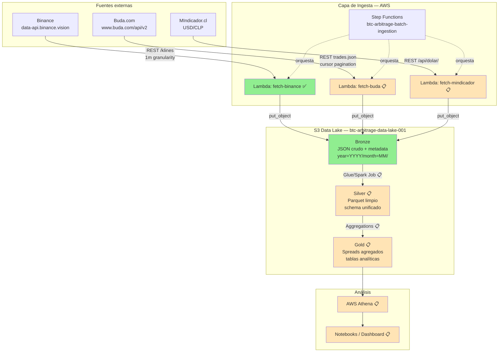

# README — Estructura propuesta (versión punteada)

> Este archivo es un **borrador estructural** del README final. Cada sección
> indica qué debe ir cuando se redacte, con notas y placeholders. **No es el
> README final** — es el plan para escribirlo conforme avance el proyecto.

---

## Sección 1: Header

**Qué incluir:**
- Título: `# Crypto Arbitrage Scanner`
- Subtítulo de 1-2 líneas que describa el qué y el por qué. Ejemplo de tono:
  > "Pipeline de Data Engineering en AWS para detectar oportunidades de
  > arbitraje histórico de Bitcoin entre Binance (mercado global) y
  > Buda.com (mercado chileno), normalizado por el tipo de cambio USD/CLP."
- (Opcional, cuando aplique) Badges: build status, license, etc.

**Notas:**
- No usar adjetivos vagos ("rápido", "robusto"). Reservar para la sección
  de métricas concretas.
- El subtítulo debe responder en una sola lectura: ¿qué problema resuelve?

---

## Sección 2: Diagrama de arquitectura (Mermaid)

**Qué incluir:** un diagrama Mermaid del flujo de datos completo. Aquí dejo
una versión inicial que cubre la arquitectura objetivo (incluyendo las fases
aún no implementadas, marcadas como pendientes):



**Leyenda:** verde = implementado, amarillo/naranja = pendiente (📋).

**Notas:**
- Mantén actualizado el diagrama conforme avance el proyecto. Es lo primero
  que ve un reviewer.
- Si en el futuro quieres un diagrama más bonito con iconos AWS, herramientas:
  draw.io con stencil set oficial de AWS, o `awsdac` (AWS Diagram as Code).

---

## Sección 3: Quick stats / métricas concretas

**Qué incluir:** tabla o lista de métricas concretas del pipeline ya
implementado. Esto es lo que más impresiona en 10 segundos de scan.

**Plantilla:**

```markdown
## 📊 Métricas

| Métrica | Valor |
|---------|-------|
| Símbolos cubiertos | BTCUSDT |
| Granularidad | 1 minuto |
| Período histórico | 2017-08 a 2026-04 (~9 años) |
| Total de klines ingeridos | ~4.5M |
| Tamaño en S3 (bronze, JSON) | ~824 MB |
| Tiempo total de backfill | 7 min 27 s |
| Concurrencia Step Functions | 3 |
| Particionado | Hive (`year=YYYY/month=MM/`) |
```

**Notas:**
- Estas métricas son **reales** del backfill ejecutado. Mantenerlas
  actualizadas conforme se agreguen Buda y MIndicador.
- Considera agregar la métrica de "speedup vs script secuencial" cuando
  redactes — es una historia muy efectiva: ~1 día → 7.5 min.

---

## Sección 4: Qué hace y por qué (problema → solución)

**Qué incluir:**
- **Problema:** explicar qué es el arbitraje y por qué BTC entre Binance/Buda.
  Mencionar la baja liquidez de Buda como factor relevante (genera spreads
  más amplios y persistentes).
- **Solución:** descripción narrativa de lo que el pipeline hace,
  end-to-end. Útil para el lector que no conoce el dominio.
- **Alcance del MVP:** qué cubre y qué no. Incluir la decisión de "Fase A
  primero, Fase B (live) después".

**Notas:**
- 2-3 párrafos máximo. Si te excedes, mover detalles a `docs/`.
- Útil dejar claro desde aquí que **este es un proyecto de portfolio**,
  no un sistema de trading real. Esto pone expectativas correctas y libera
  al lector de evaluarlo en términos de ROI financiero.

---

## Sección 5: Stack técnico

**Qué incluir:** lista breve de tecnologías por capa.

**Plantilla:**

```markdown
## 🛠️ Stack

- **Cloud:** AWS (us-east-2)
- **Compute:** AWS Lambda (Python 3.11)
- **Orquestación:** AWS Step Functions
- **Storage:** Amazon S3 (data lake con particionado Hive)
- **IaC:** Terraform (~> 5.0)
- **Procesamiento (planeado):** AWS Glue / PySpark
- **Análisis (planeado):** AWS Athena
- **Lenguajes:** Python, HCL (Terraform), SQL (Athena)
```

**Notas:**
- No mencionar tecnologías que no se usan ("podríamos usar Kafka..."). Solo
  lo que está construido o decididamente planeado.

---

## Sección 6: Estructura del proyecto

**Qué incluir:** árbol del repositorio con explicación breve de cada carpeta.

**Plantilla (actualizar conforme crezca):**

```
crypto-arbitrage-scanner/
├── infra/                          # Terraform IaC
│   └── main.tf
├── lambdas/                        # Código de Lambda functions
│   ├── fetch_binance/
│   │   └── handler.py
│   ├── fetch_buda/                 # 📋 pendiente
│   └── fetch_mindicador/           # 📋 pendiente
├── transformations/                # 📋 Jobs de bronze→silver→gold
├── docs/
│   ├── api_discovery.md            # Análisis de APIs externas
│   ├── data_quality.md             # Reglas de calidad de datos
│   └── architecture.png            # 📋 Diagrama detallado
├── scripts/
│   └── generate_backfill_periods.py
├── backfill_input.json             # Input para Step Functions
└── README.md
```

---

## Sección 7: Cómo ejecutarlo

**Qué incluir:**
- Prerequisitos (AWS CLI configurada, Terraform, Python).
- Comandos para desplegar.
- Comandos para lanzar el backfill.
- Cómo verificar resultados.

**Plantilla:**

```markdown
## 🚀 Cómo ejecutar

### Prerequisitos
- AWS CLI con credenciales configuradas
- Terraform >= 1.5.0
- Python 3.11+

### Despliegue

\`\`\`bash
cd infra/
terraform init
terraform apply
\`\`\`

### Backfill histórico (Binance)

\`\`\`bash
python scripts/generate_backfill_periods.py > backfill_input.json

aws stepfunctions start-execution \\
  --state-machine-arn $(cd infra && terraform output -raw state_machine_arn) \\
  --input file://backfill_input.json
\`\`\`

### Verificación

\`\`\`bash
aws s3 ls s3://btc-arbitrage-data-lake-001/bronze/backtest/binance/ \\
  --recursive | wc -l   # Debería retornar 112
\`\`\`
```

**Notas:**
- Mantén los pasos minimalistas. Si requiere muchos pasos, algo está mal
  diseñado en la automatización.
- Considera agregar después un Makefile o `justfile` que envuelva estos
  comandos: `make deploy`, `make backfill`, `make verify`. Es muy pro.

---

## Sección 8: Decisiones arquitectónicas destacadas

**Qué incluir:** 2-4 decisiones técnicas no obvias, cada una en 2-3 líneas
con link al doc completo en `docs/`.

**Plantilla:**

```markdown
## 🏛️ Decisiones de arquitectura

### Endpoint Binance: data-api.binance.vision (no api.binance.com)

Detectado durante pruebas: las IPs de AWS en regiones US son rechazadas con
HTTP 451 por restricciones regulatorias de Binance. Se adoptó el subdominio
público de market data, que comparte el mismo contrato pero sin restricciones
geográficas. Detalles en [docs/api_discovery.md](docs/api_discovery.md#11-análisis-de-conectividad).

### Bronze fiel a la fuente, deduplicación en silver

La capa bronze preserva el output crudo de las APIs sin modificación alguna,
incluyendo solapamientos esperados en paginación. La limpieza ocurre en
silver. Detalles y trade-offs en
[docs/data_quality.md](docs/data_quality.md).

### Concurrencia controlada en Step Functions

Step Functions con `MaxConcurrency = 3` paraleliza la ingesta sin saturar
los rate limits de Binance (1200 weight/min). Resultado empírico: 4.5M de
klines descargados en 7.5 minutos vs ~1 día en script secuencial.
```

**Notas:**
- **Esta es la sección más importante para evaluadores técnicos.**
  Demuestra que tomas decisiones conscientes, no copias tutoriales.
- Cada decisión debe incluir: contexto, decisión, justificación, trade-offs.
- Patrón estándar: ADR (Architecture Decision Record). Considera
  formalizarlos en `docs/adr/` si crecen mucho.

---

## Sección 9: Roadmap

**Qué incluir:** estado actual y próximas fases con check boxes.

**Plantilla:**

```markdown
## 🗺️ Roadmap

### ✅ Fase A.1 — Ingesta histórica de Binance (completado)
- [x] Lambda con paginación, idempotencia, manejo de rate limits
- [x] Step Functions orquestando 112 invocaciones mensuales
- [x] ~4.5M klines en data lake S3 con particionado Hive
- [x] Documentación de APIs y calidad de datos

### 📋 Fase A.2 — Ingesta de Buda (en curso)
- [ ] Handler con cursor-based pagination
- [ ] Throttling para respetar ~20 req/min de la API
- [ ] Backfill histórico de trades BTC-CLP

### 📋 Fase A.3 — Ingesta de tipo de cambio
- [ ] Handler para MIndicador.cl
- [ ] Manejo de fines de semana y festivos

### 📋 Fase A.4 — Capa silver (transformación)
- [ ] Glue Job o PySpark Lambda: JSON → Parquet
- [ ] Schema unificado entre fuentes
- [ ] Deduplicación y enriquecimiento

### 📋 Fase A.5 — Capa gold y análisis
- [ ] Joins temporales entre Binance/Buda/USD-CLP
- [ ] Tablas agregadas de spreads
- [ ] Athena queries y dashboards de hallazgos

### 📋 Fase B — Live monitoring (futuro)
Arquitectura bosquejada (no implementada): Fargate task con WebSocket a
`data-stream.binance.vision` + polling a Buda → EventBridge → notificaciones.
```

**Notas:**
- Marcar progreso con `[x]` y `[ ]` da sensación de avance al lector.
- Mostrar Fase B explícitamente como "futuro" demuestra capacidad de pensar
  en evolución sin sobre-comprometerse.

---

## Sección 10: Lecciones aprendidas

**Qué incluir:** 3-5 cosas no triviales que aprendiste construyendo esto.
Esta sección **es opcional pero te diferencia mucho** — pocos developers la
escriben y demuestra capacidad de reflexión.

**Plantilla con candidatos a partir de lo que ya viviste:**

```markdown
## 💡 Lecciones aprendidas

- **Geo-bloqueos no son visibles hasta que pegan.** Diagnosticar HTTP 451
  desde Lambda en us-east-2 vs lo que asumí inicialmente (problema de VPC).
  Los logs detallados con un "ping de diagnóstico" al inicio del handler
  ahorraron horas de debugging.

- **Paralelización trivial > optimización compleja.** Mi implementación
  anterior en script tardaba ~1 día. Step Functions con concurrencia 3 lo
  redujo a 7.5 minutos. La aceleración no vino de optimizar el código sino
  de cambiar la arquitectura.

- **"Bronze fiel a la fuente" no es purismo, es resiliencia.** Documentar
  el solapamiento de paginación en lugar de evitarlo en el handler permite
  reprocesar sin re-llamar a las APIs externas si la lógica de limpieza
  cambia.

- **Validar empíricamente las suposiciones.** Asumí que BTCUSDT empezó en
  noviembre 2017. Los datos mostraron agosto. Pequeño detalle, pero
  ilustrativo del principio.
```

**Notas:**
- Tono: honesto, no presumido. "Aprendí X" es mejor que "Soy experto en X".
- Mantener entre 3 y 5 puntos. Más es ruido.

---

## Checklist final antes de publicar el README

- [ ] El subtítulo es comprensible en una sola lectura.
- [ ] Hay un diagrama (Mermaid o imagen) en los primeros 200px de scroll.
- [ ] Las métricas son números reales, no estimaciones.
- [ ] Los comandos en la sección "Cómo ejecutar" funcionan tal como están.
- [ ] No se usan adjetivos vagos ("rápido", "robusto", "production-grade").
- [ ] Cada link a `docs/` apunta a un archivo que existe.
- [ ] El estado de cada fase en el roadmap refleja la realidad.
- [ ] Sin typos (revisar con un linter de markdown o IA antes de publicar).
- [ ] Vista previa renderizada en GitHub funciona correctamente.

---

## Recursos para escribir el README final

- **"How to write a good README"** — Akash Nimare en freeCodeCamp.
- **awesome-readme** en GitHub: ejemplos de READMEs ejemplares.
- **The Documentation System** (Daniele Procida, divio.com): framework de
  4 modos de documentación.
- **README de proyectos de referencia** en data engineering:
  - [airbyte/airbyte](https://github.com/airbytehq/airbyte)
  - [dbt-labs/dbt-core](https://github.com/dbt-labs/dbt-core)
  - [dagster-io/dagster](https://github.com/dagster-io/dagster)